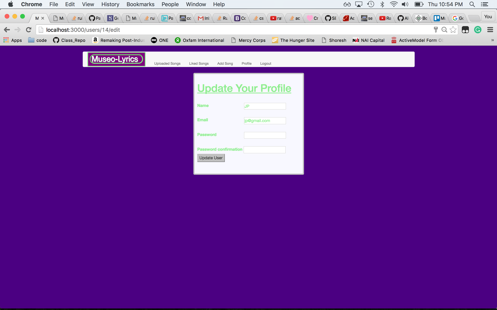
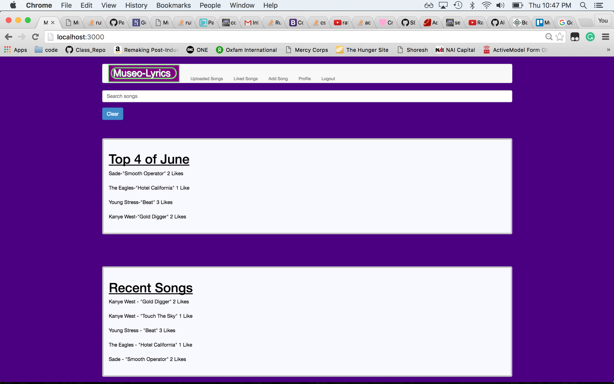
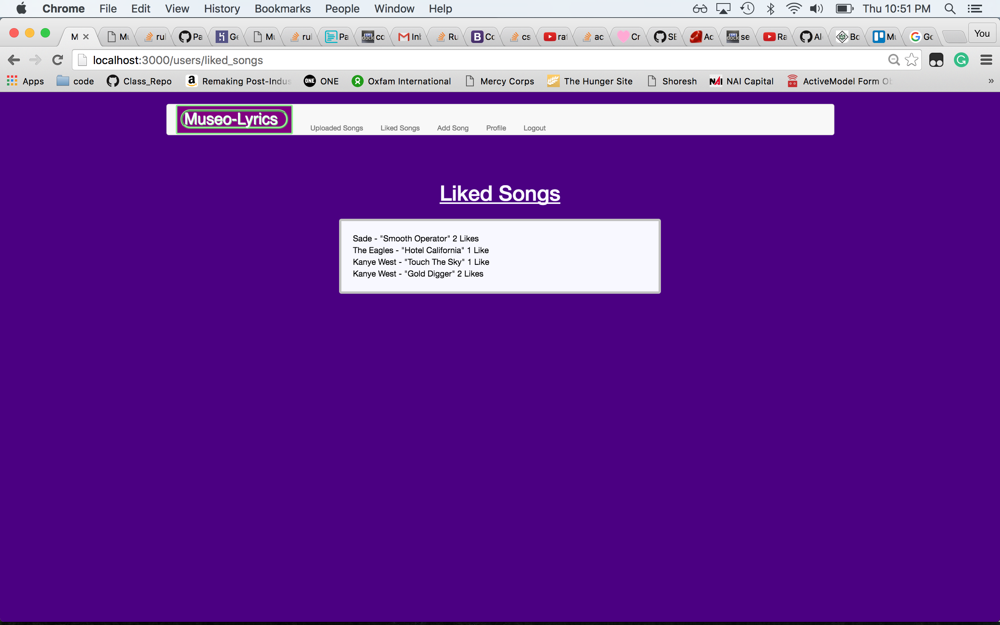
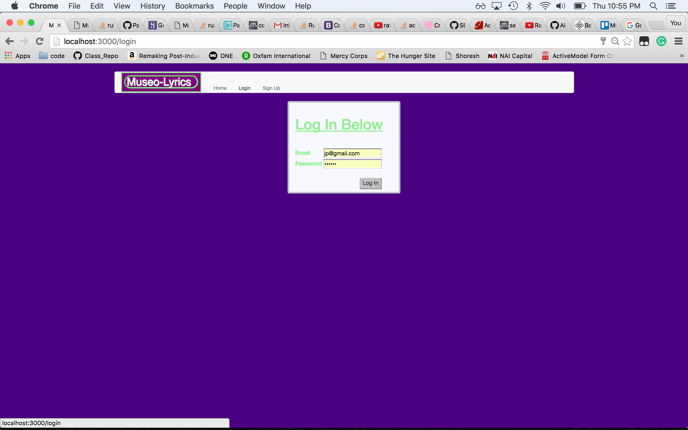
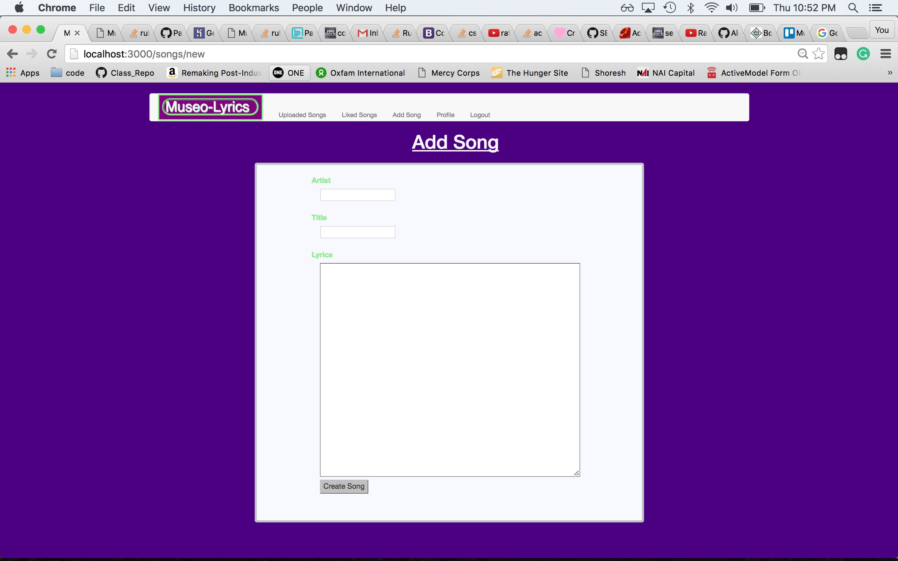
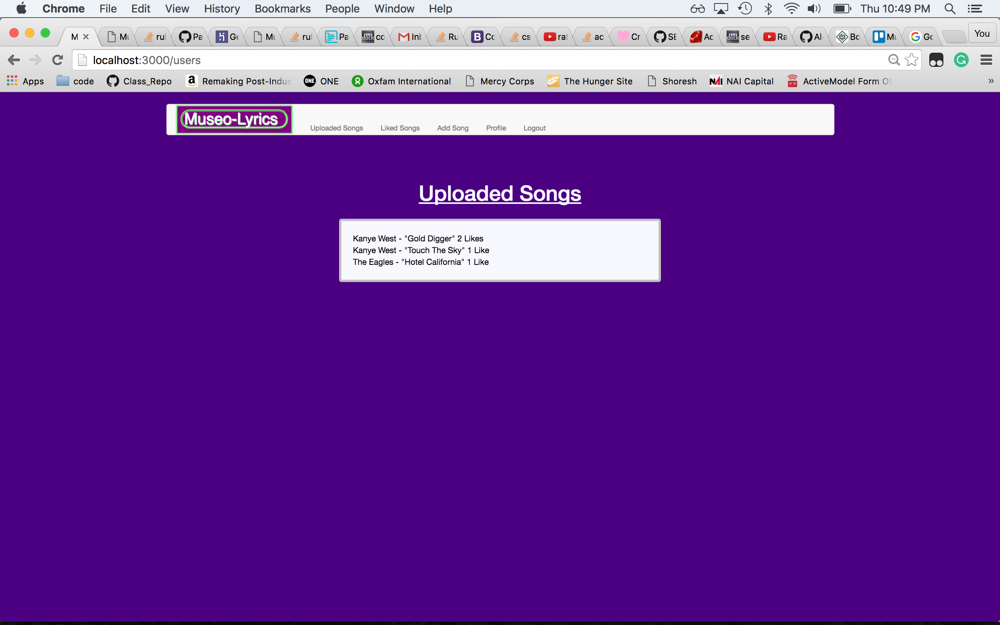
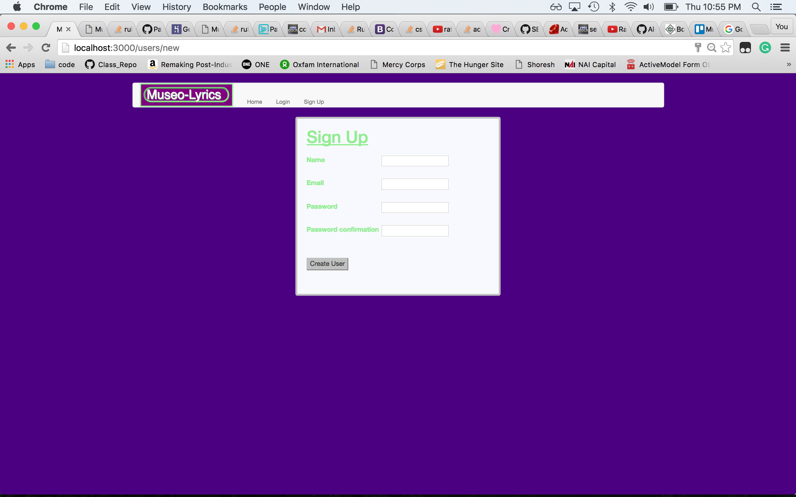

# Museo-Lyrics

# This is a full CRUD application using Ruby on Rails.

Museo-Lyrics allows users to search and contribute lyrics to our collection of user submitted songs.

Planning: https://trello.com/b/ulwD3wxT/museo-lyrics

# Technologies Used

    - HTML5
    - CSS
    - Ruby on Rails

# Design

# Get Started
    
Deployed via Heroku: https://museo-lyrics.herokuapp.com/
